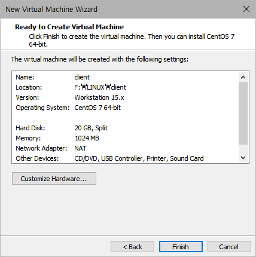
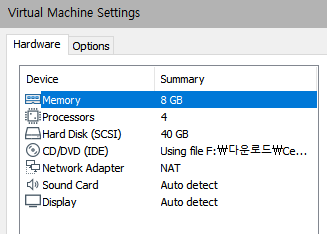

# 리눅스 설치

## 필요한 파일 다운로드

1. VMWare

   VMware-player-15.5.1-15018445.exe 파일 [다운로드](https://www.filehorse.com/download-vmware-player/44878/)

2. 추가 파일 vmnetcfg_15_5_1.zip

3. Linux Download - CENTOS 7(2003) x86_64

   CentOS-7-x86_64-DVD-2003.iso [다운로드](https://www.centos.org/centos-linux/)


## VMWare 설치

1. vmnetcfg_15_5_1.zip 압축을 풀고 안의 vmnetcfg 파일을 Program Files (x86)\VMware\VMware Player ( VMWare 설치 디렉토리 )로 이동후 실행

2.  Network Setting [51p]

   Network Setting은 고정 IP 환경을 만들기 위해 한다.
   
   * vmnetcfg.exe > Change Setting > VMnet8 > Subnet IP 192.168.111.0 > OK


## 가상 머신 생성하기

1. VMWare 실행 > Create a New Virtual Machine (23p)

   * I will install the operating system later. > Linux > CentOS 7 64-bit
   * 저장위치 설정 > 20GB
   * 

2. Edit virtual machine setting (26p)

   

   * Hard Disk > Remove > Add... > SCSI > Create a new virtual disk 
     -> 40GB, Store virtual disk as a single file


## CentOS 설치하기

1. 생성한 가상 머신을 실행 시키면 OS설치가 진행된다.

2. 초기 환경 설정하기 ( 74p )

3. update를 안하도록 문서 편집이 필요하다.

   ```bash
   $# cd /etc/yum.repos.d/
   $# gedit CentOS-Base.repo 
   ```

   [update] 부분 이하를 삭제

4. 네트워크 설정 (Network IP Static 하게, 95p)

   ```bash
   $# cd /etc/sysconfig/network-scripts/
   $# gedit ifcfg-ens32
   
   BOOTPROTO="none"
   IPADDR="192.168.111.101"	:사용할 IP번호
   NETMASK="255.255.255.0"
   GATEWAY="192.168.111.2"
   DNS1="192.168.111.2"
   
   $# systemctl restart network	:네트워크 재시작
   $# ifconfig		:IP번호 확인
   ```

5. 보안 설정 해제

   ```bash
   $# cd /etc/sysconfig/
   $# gedit selinux
   
   SELINUX=disable
   ```

6. 소프트웨어 업데이트 해제

   소프트웨어 > 업데이트 기본설정 > 최신 패키지만 해제

## 리눅스 복제하기

1. Linux가 설치된 Dir을 복사 한다.
2.  Dir 이름을 변경한다.
3. server.vmx 파일을 열어 displayName = "" 을 변경 한다.
4. wmware에서 "Open Virtual Machine" 후 새로 만든 폴더에.vmx 파일 선택
5. Edit Virtual Machine setting
   1. Network Adapter 에 advanced 선택
   2. MAC Address에서 새롭게 Generate 실행
6. "Play Virtual Machine" 실행 
7. 반드시 "moved it" 선택 
8. 반드시 IP 변경