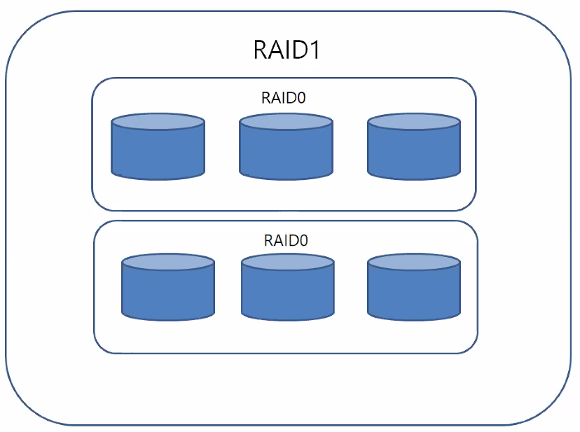

# 하드디스크 추가하기

> 333p
>
> 일반적인 컴퓨터 IDE방식으로 4개
>
> 서버사이드에서는 SCSI방식으로 16개까지 붙일 수 있다.
>
> 우리는 컴퓨터를 여러대 서버에다 관리하는 시스템으로 관리한다.

* 오늘 할 일

>  335p처럼 여러개의 하드디스크를 붙일 예정이다.
>
> mydata라는 하드디스크를 붙일 것이다.


### 실습준비

> 337p

1. 새로운 서버(raidserver)를 만든다.

2. Edit virtual machine settings > Add.. > Hard Disk > SCSI  > new... > 1GB, single

   자동으로 하드디스크를 인식하지 않으므로 등록해 주어야 한다.

   ```bash
   '확인'
   $# ls -l /dev/sd*
   $# cd /dev
   ```

   

3. 하드디스크에 파티션 할당 ( 340p )

   ```bash
   $# fdisk /dev/sdb
   Command : n				:파티션 분할
   Select : p				:primary 파티션 선택
   Partition number : 1	:파티션 번호 1
   First sector : enter
   Last sector : enter
   Command : p				:내용확인
   Command : w				:설정 저장
   ```

4. 할당한 하드디스크 포맷 ( 341p, step4, ext4구조)

   ```bash
   $# mkfs.ext4 /dev/sdb1
   ```

5. 디렉터리 마운트 ( 342p )

   ```bash
   $# mkdir /mydata				: 폴더 생성
   $# cd /mydata
   $# touch mydata.txt
   $# mount /dev/sdb1 /mydata	: 마운트, touch로 만든 파일이 사라짐
   $# umount /dev/sdb1			: 마운트 해제
   > fstab에 등록하지 않고 reboot하면 마운트가 해제된다.
   ```
   
6. fstab에 등록하기 ( 334p )

   ```bash
   $# vi /etc/fstab
   맨 아래에 o
   /dev/sdb1 /mydata ext4 defaults 0 0 추가
   ```

7. 확인하기

   ```bash
   $# df
   /dev/sdb1    1998672    6144    1871288   1% /mydata
   ```


## RAID

* RAID란 ( 347p )

  > 여러개의 하드디스크를 하나의 하드디스크처럼 사용하는 방식이다.
  >
  > 비용을 절감하면서도 신뢰성을 높이며 성능까지 향상시킬 수 있다.

  * 하드웨어 RAID : 안정적이고 성능좋은 제품은 고가
  * 소프트웨어 RAID : 신뢰성이나 속도등은 떨어지지만 저렴한 비용

* RAID레벨

  * 기본적으로 구성 방식에 따라 Linear RAID, RAID 0, RAID 1, RAID 2~RAID 5
  * 주로 사용하는 방식 : Linear RAID, RAID 0, RAID 1, RAID 5, RAID 6

* Linear RAID

  > 앞 하드디스크에 데이터가 완전히 저장된 후 다음 하드디스크에 데이터를 저장한다.

* RAID 0

  > 모든 하드디스크를 동시에 사용한다.
  >
  > 한개의 분할하여 저장한다. 저장속도 증가, 데이터 위험성 증가
  >
  > 장점, 저장되는 시간효율이 향상된다.
  >
  > 단점, 하나의 하드디스크가 고장나면 전체의 데이터가 고장나게 된다.

* Linear RAID와 RAID 0의 저장방식이 달라지는 이유 ( 349 p)

  > 하나의 파일을 받는데 LinearRAID는 한개씩 다운로드 되는데 RAID 0는 분리된 개수만큼 속도가 빨라진다.

* RAID 1

  > 미러링, 데이터를 복제해 저장한다.
  >
  > 공간효율이 절반 -> 비용이 두배
  >
  > 저장속도는 같은 데이터가 동시에 저장 -> 속도변화 X
  >
  > 중요도가 높은 데이터를 저장할 때 사용한다.

* RAID 5

  > 패리티(Parity)를 이용하여 저장, 복구한다.
  >
  > 안정성, 공간효율성을 향상 시키기 위해 나왔다.
  >
  > 단점, 2개 이상의 하드디스크가 고장나면 복구가 불가능하다.

* RAID 6

  > RAID 5의 단점을 개선하기위해 나왔다.
  >
  > 2개의 패리티를 사용
  >
  > 단점, 내부 알고리즘이 복잡해져 RAID 5보다 성능이 약간 떨어진다.

* 그 외 

  * RAID 1+0

    * 가장 많이 쓰는 방식이다. RAID1과 RAID0을 합하여 사용

    * 신뢰성과 성능을 동시에 확보할 수 있다.

      

  * RAID 1+6

    * 공간효율이 25%(비싸고 느린성능)이지만 안정성에서는 탁월


### RAID 실습 (Linear, 0, 1, 5) 

실습전 준비 (358p)

* 하드 디스크 9개 준비 (상단 실습 준비 참고)

  ```bash
  $# ls -l /dev/sd*	:장착된 디스크 확인
  ```

* 파티션 할당 (sdb ~ sdj)

  ```bash
  $# fdisk /dev/sdb
  Command : n				:파티션 분할
  Select : p				:primary 파티션 선택
  Partition number : 1	:파티션 번호 1
  First sector : enter
  Last sector : enter
  Command : t				:파일 시스템 유형
  Hex Code : fd			:선택한 파일 시스템 유형 번호
  Command : p				:내용확인
  Command : w				:설정 저장
  ```

  

#### Linear RAID (364p)

fdisk > mdadam > mkfs.ext4 > mount > fstab에 등록

1. fdisk (파티션 할당, 실습준비에서 이미 다룬내용)

   ```bash
   $# fdisk -l /dev/sdb
   $# fdisk -l /dev/sdb
   ```

2. mdadm

   ```bash
   $# mdadm --create /dev/md9 --level=linear --raid-devices=2 /dev/sdb1 /dev/sdc1
   "명령어 설명
   --create /dev/md9 	: md9 장치에 생성
   --level=linear		: Linear RAID 지정
   --raid-devices=2 	: 2개의 하드디스크 사용 "
   
   $# mdadm --detail --scan 	: md9으로 묶여있는 것을 볼 수 있다.
   ARRAY /dev/md9 metadata=1.2 name=server:9 UUID=cd2a0110:1b67d6af:9d561340:273cf818
   ```

3. 포맷

   ```bash
   $# mkfs.ext4 /dev/md9
   ```

4. 폴더 만들고 mount

   ```bash
   $# mkdir /raidLinear
   $# mount /dev/md9 /raidLinear
   ```

5. fstab 등록

   ```bash
   $# vi /etc/fstab
   /dev/md9 /raidLinear ext4 defaults 0 0
```
   


#### RAID 0 (367p)

```bash
$# mdadm --create /dev/md0 --level=0 --raid-devices=2 /dev/sdd1 /dev/sde1

$# mkdir /raid0				:폴더 만들기
$# mkfs.ext4 /dev/md0		:포맷
$# mount /dev/md0 /raid0	:mount
$# vi /etc/fstab
/dev/md0 /raid0 ext4 defaults 0 0
```


#### RAID 1,5

> RAID 0과 같이 생성 mdadm에서 level만 다르게 생성해준다.


### RAID 생성 취소하기

```bash
$# vi /etc/fstab	: 주석
$# umount /dev/md9
$# mdadm --stop /dev/md9
```


```bash
$# df		: 상태 보기
```


### 데이터 고장내기 (375p)

* 준비

  ```bash
  cp /boot/vmlinuz-4* /raidLinear/testFile 	:가짜 데이터 넣어놓기
  ```

* 376p 고장내기 (VMware > Edit.. > hard disk  remove)

* 381p 전원을 켜면 응급모드(Emergency mode)로 접속된다.

  * fstab에서 등록을 주석처리 또는 제거

  ```bash
  $# vi /etc/fstab
  ```

  * 결함허용을 제공하지 않는 RAID장치는 중지시킨다.

  ```bash
  $# mdadm --stop /dev/md9	:Linear RAID
  $# mdadm --stop /dev/md0	:RAID 0
  ```

* Reboot

* Linear RAID, RAID 0는 복구 불가 새롭게 생성한다.

* RAID 1, RAID 5는 구조상 복구 가능, 디스크를 추가한다.

  * 새로운 하드디스크 fdisk > 추가 (387p)

  ```bash
  $# mdadm /dev/md1 --add /dev/sdg1
  
  $# mdadm --detail /dev/md1 		: 확인
  ```

* fstab 다시 등록


---

+ 속도나 신뢰성에따라 RAID 구성도는 달라질 수 있다.


### RAID 1+0 실습 (393p)

```bash
ls -l /dev/sd*

... fdisk /dev/...

mdadm ---create /dev/md1 --level=1 --raid-devices=2 /dev/sdf1 /dev/sdg1

mdadm ---create /dev/md2 --level=1 --raid-devices=2 /dev/sdh1 /dev/sdi1

ls /dev/md*	:확인

mdadm ---create /dev/md10 --level=0 --raid-devices=2 /dev/md1 /dev/md2

mkfs.ext4 /dev/md10	:포맷, 필수!

mkdir /raid10

mount /dev/md10 /raid10

df	:확인

vi /etc/fstab 

/dev/md10 /raid10 ext4 defaults 0 0	:껏다 켜도 mount적용

cp /boot/vmlinuz-3* /raid10/testFile

cd /raid10	:testFile이 저장된 것이 보임.

poweroff
```


#### 데이터 고장내기

VMware에서(398p)	: Disk뽀개기

Edit >6, 8번 Remove >poweron

데이터는 살아있지만 온전하게 원상복귀된 것은 아니다.

디스크 붙여서 복귀시키기.

1. Disk 설치

2. WMware시작

3. fdisk /dev/sdg

   fdisk /dev/sdh

4. mdadm /dev/md1 --add /dev/sdg1

   mdadm /dev/md2 --add /dev/sdh1

5. reboot


## 워크샵 raid2server

모든 raid구성 지우고 reboot

p402 raid 1+6 구성 만들기

/raid16 폴더에 마운트 한 후 파일을 복사

poweroff

디스크sdd와 sde를 삭제한 후 부팅 파일이 정상 인지 확인 후

디스크 2개를 새로 설치하여 복구하시오