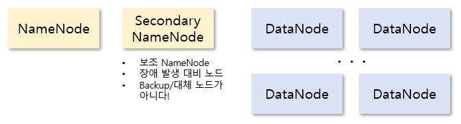
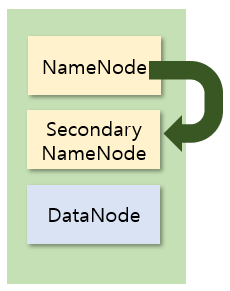

# 하둡

## 빅데이터

* 정의

  * 데이터가 큰경우 : 수만 테라바이트

    * 기존 데이터베이스 관리도구의 데이터 수집, 저장, 관리, 분석하는 역량을 넘어서는 데이터

  * 업무 수행 방식에 초점

    * 다양한 종류의 대규모 데이터로부터 __저렴한 비용__으로 가치 추출, 데이터의 빠른 수집, 발굴, 분석을 할 수 있도록 하는 기술/아키텍쳐

  * BI : 비지니스 방향성을 제시하는 것

  * DW : 

  * 빅데이터의 3대 요소 (3V+α)

    * 크기 (Volume) : 대용량 데이터

    * 속도 (Velocity) : (입출력 속도) 큰 용량의 데이터를 빠르게 처리 (효율을 향상시키기위해 분산 환경을 발전시키게 되었다.)

      > 실시간처리와 장기적 처리로 나뉜다.
      >
      > * 장기적처리 : 통계학과 전산학에서 사용되던 데이터 마이닝, 기계학습, 자연어 처리, 패턴 인식 등이 이러한 분석기법에 해당한다.
      >
      > 아무리 빅데이터 시스템이 빨라도 아직 리얼타임은 불가능

    * 다양성 (Variety) : 계량화 및 수치화가 어려운 비정형적 데이터를 포함

      > 정형(structured), 반정형(semi-structured), 비정형(unstructured)으로 나뉜다.
      >
      > * 반정형 : 고정된 필드X but 메타데이터나 스키마등을 포함
      > * 비정형 : SNS, 오디오, 비디오, 대화내용 등

      +

    * 정확성 (Veracity) : 분석 목적에 맞는 데이터를 선별하고 수집하는 것이 분석 결과의 정확성에 영향을 미친다.

    * 가치 (Value) : 빅데이터를 통해 어떤 문제를 해결할 수 있는지.

  * 출현 배경

    > 스마트폰과 같은 디지털 기기의 보급, SNS(Social Network Service)의 부상

## 하둡

* 하둡이란?

  * 대용량 데이터를 분산 처리할 수 있는 자바기반의 오픈소스 프레임워크
  * 분산 파일 시스템인 HDFS에 데이터를 저장
  * 분산 처리 시스템인 맵리듀스를 이용해 데이터를 처리

* 왜 하둡인가?

  > 정형화된 데이터는 기존의 관계형 데이터베이스(RDBMS)에 저장
  >
  > 웹 로그와 같은 비정형화된 데이터를 RDBMS에 저장하기에는 데이터크기가 너무 크다.
  >
  > RDBMS 장비는 대부분 고가, 이를 감당하기 위해 무한정 늘릴 수 없다.
  >
  > * 오픈소스 프로젝트이기 때문에 비용 부담 X


하둡서버(hadoopserver) 만들기


## 하둡 에코 시스템

> 하둡은 비즈니스에 효율적으로 적용할 수 있게 다양한 서브 프로젝트를 제공한다. 이들이 상요화되면서 하둡 에코시스템이 구성되었다.
>
> 우리가 쓸것은 Hive

* Hive

  > 하둡 기반의 데이터하우징용 솔루션


## 하둡에 대한 오해

* 오라클, MySQL같은 RDBMS를 대체한다고 오해하는 것
* 하둡은 DB와 별도, 상호보완적인 특성
* 하둡은 트랜잭션이나 무결성이 반드시 보장되어야 하는 데이터를 처리하는 데 적합하지 않다. 때문에 무결성이 중요한 데이터는 트랜잭션별로 무셜성을 보장하는 RDBMS에서 처리하고, 하둡은 **배치성**(주기적 행위)으로 데이터를 저장하고, 처리해야한다.


# 하둡 개발 준비


* 하둡 환경 (이미지_ 완전 분산모드)

  

NameNode에서 각각의 데이터 노드를 검사하는 것이 아닌 데이터 노드에서 살아있는신호를 보낸다.

* 독립 실행(Standalone) 모드
  * 하나에서만
* 가상 분산(Pseudo-distributed) 모드 > 우리가 할 내용
  * 한대의 컴퓨터 안에 NameNode, Secondary NameNode, DataNode모두 들어있는 모드
* 완전 분산(Fully distributed) 모드 
  * 여러대의 장비에 하둡이 설치 > 현업에서 사용된다.

## 하둡 설치

1. Linux OS 준비
2. Java 설치
3. SSH 설정 

### SSH 설정 (보안설정)

> NameNode가 Secondary NameNode, DataNode에 자유롭게 데이터를 가져와야한다.
>
> 암호화 필요.
>
> 
>
> 같은 컴퓨터임에도 접속하려면 네트워크를 통해 접속해야하기 때문에 암호화가 필요한 것이다.

1. 방화벽 해제

   ```bash
   $# systemctl stop firewalld
   $# systemctl disable firewalld
   ```

2. 내 컴퓨터에 public key & private key생성

   ```bash
   'cd 후에 할 것'
   $# ssh-keygen -t dsa -P '' -f ~/.ssh/id_dsa
   $# cd .ssh
   $# cat id_dsa.pub >> authorized_keys
   ```

   * 공개키는 사용자 계정의 홈 디렉터리에 있는 .ssh 폴더에 생성된다.

3. 연결 확인

   ```bash
   $# ssh hadoopserver
   해제
   exit
   ```

### 하둡 설치

1. 다운로드

   ```bash
   $# wget https://archive.apache.org/dist/hadoop/common/hadoop-1.2.1/hadoop-1.2.1.tar.gz
   ```

2. 압축 해제

   ```bash
   $# tar xvf hadoop-1.2.1.tar.gz 
   ```

3. 복사

   ```bash
   $# cp -r hadoop-1.2.1 /usr/local
   ```

4. 수정

   ```bash
   $# vi /etc/profile
   
   54 HADOOP_HOME=/usr/local/hadoop-1.2.1
   55 export+ HADOOP_HOME
   56 PATH+ bin: $HADOOP_HOME/bin:.:$PATH
   ```

5. reboot

## 하둡 환경설정

1. 하둡 환경설정 파일 위치 (53p)

   ```bash
   $# cd /usr/local/hadoop-1.2.1/conf
   ```

2. masters, slaves는 가상 분산을 할 것 이므로 X

3. core-site.xml

   * 공통 사용 환경정보

   ```bash
   $# vi cor-site.xml
   ```

   ```xml
   <configuration>
   <property>
   <!--메인컴퓨터(NameNode) 정보 저장-->
   <name>fs.default.name</name>
   <value>hdfs://localhost:9000</value>
   </property>
   <property>
   <!--하둡 임시 데이터 저장을 위한 공간-->
   <name>hadoop.tmp.dir</name>
   <value>/usr/local/hadoop-1.2.1/tmp</value>
   </property>
   </configuration>
   ```

4. hdfs-site.xml 

   * hdfs 환경정보

   ```bash
   $# vi hdfs-site.xml 
   ```

   ```xml
   <configuration>
   <property>
   <name>dfs.replication</name>
   <value>1</value> 
   </property>
   <property>
   <!--웹접근 가능 유무-->
   <name>dfs.webhdfs.enabled</name>
   <value>true</value>
   </property>
   <property>
   <!--모든 컴퓨터 정보가 name폴더에 들어간다.-->
   <name>dfs.name.dir</name>
   <value>/usr/local/hadoop-1.2.1/name</value>
   </property>
   <property>
   <name>dfs.data.dir</name>
   <value>/usr/local/hadoop-1.2.1/data</value>
   </property>
   </configuration>
   ```

5. mapred-site.xml

   * 처리와 분석에 관련된 환경설정 파일

   ```bash
   $# vi mapred-site.xml
   ```

   ```xml
   <configuration>
   <property>
   <!--프로세서 : job tracker-->
   <name>mapred.job.tracker</name> 
   <value>localhost:9001</value>
   </property>
   </configuration>
   ```

6. hadoop-env.sh

   ```bash
   $# vi hadoop-env.sh
   9 export JAVA_HOME=/usr/local/jdk1.8.0
   10 export HADOOP_HOME_WARN_SUPPRESS="TRUE"
   	:하둡 실행시 경고뜨는거 제거
   ```


## 하둡 실행

1. 포맷

   ```bash
   $# hadoop namenode -format
   $# start-all.sh
   $# jps
   	: 총 6개 항목이 떠야 한다.
   ```

2. 오류일때 > 재 포맷

   * stop-all.sh

   * hadoop 폴더에서 지울 디렉토리 name, tmp, data

3. 실행 페이지

   http://hadoopserver:50075

### 실행 예제

```bash
$# cd
$# cd .ssh
$# hadoop fs -ls /usr
$# cd /usr/local/hadoop-1.2.1/
$# ls > README.txt
$# hadoop fs -mkdir /test			: 하둡에 디렉토리 생성
$# hadoop fs -put README.txt /test	: 하둡폴더에 데이터 이동
$# hadoop jar hadoop-examples-1.2.1.jar wordcount /test /output	:test에있는걸 분석후 output으로
```


안되면 stop-all.sh후에 폴더 지우고 포맷 다시

stop-all.sh하고 전원끄기

