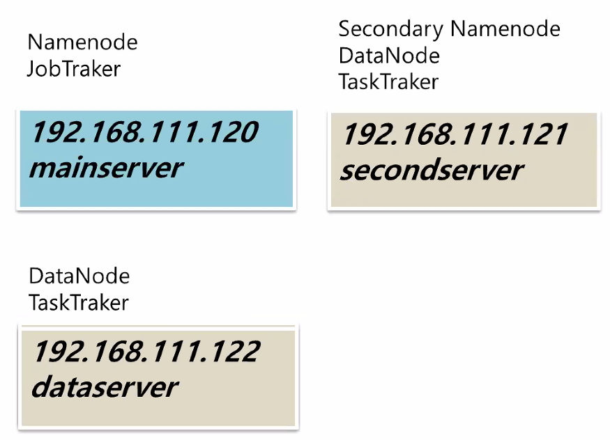

## 하둡 환경 만들기

목표이미지



namenode jobtraker	:일을 시키고

secondary namenode	:실제 저장된데이터를...?

### 실습. 완전 분산 모드 구축하기

1. 리눅스 서버 3개 만들기

   공통 설정 : ip변경, 방화벽 해제, hostname 설정	(리눅스 프로그램 설치부분 참고)

   * hostname

   ```bash
   $# hostname								: 현재 hostname보기
   $# hostnamectl set-hostname mainserver	: hostname바꾸기
   $# vi /etc/hosts						: 다른 호스트 설정
   ```

   * ip변경

   ```bash
   $# vi /etc/profile
   $# cd /etc/sysconfig/network-scripts
   $# vi ifcfg-ens32
   $# systemctl restart network
   ```

   * 방화벽 해제

   ```bash
   $# systemctl stop firewalld
   $# systemctl disable firewalld
   ```

   

2. mainserver

   1. SSH 설정

      ```bash
      $# ssh-keygen -t dsa -P '' -f ~/.ssh/id_dsa
      $# ls .ssh
      id_dsa  id_dsa.pub				: authorized_keys 없음
      $# ssh-copy-id -i /root/.ssh/id_dsa.pub root@secondserver	:secondserver에 ssh복사
      $# ssh-copy-id -i /root/.ssh/id_dsa.pub root@dataserver
      $# ssh-copy-id -i /root/.ssh/id_dsa.pub root@mainserver	:자기 자신에게도 복사해야한다.
      [root@secondserver ~] $# ls .ssh	:secondserver에서 복사된 것을 확인
      authorized_keys
      ```

      * 결과

        ```bash
        $# ssh secondserver		: 물어보지 않고 들어가진다. (exit으로 나옴)
        ```

      * host 데이터 복사 전송

        ```bash
        [root@mainserver ~] $# scp /etc/hosts root@secondserver:/etc/hosts 		:파일전송
        [root@mainserver ~] $# scp /etc/hosts root@dataserver:/etc/hosts
        ```

        

   2. JDK 설치

      * 각 서버에 다운로드한 압축파일 전송

        ```bash
        [root@mainserver 다운로드]$# scp ./jdk-8u261-linux-x64.tar.gz root@secondserver:/root
        [root@mainserver 다운로드]$# scp ./jdk-8u261-linux-x64.tar.gz root@dataserver:/root
        ```

      * 각 서버에 자바 명령어 링크 변경

        ```bash
        [root@mainserver ~]$# scp /usr/bin/java root@secondserver:/usr/bin/java
        java       100% 8712     1.4MB/s   00:00    
        
        [root@mainserver ~]$# scp /usr/bin/java root@dataserver:/usr/bin/java
        java       100% 8712   598.9KB/s   00:00 
        ```

      * 각 서버에 옮긴 압축파일 해제 및 디렉토리 이름 변경

        ```bash
        [root@mainserver ~]$# ssh root@secondserver tar xvf /root/jdk*	:압축 프로그램 해제
        [root@mainserver ~]$# ssh root@secondserver mv jdk1.8.0_261 jdk1.8.0	:디렉토리명 변경
        [root@mainserver ~]$# ssh root@dataserver tar xvf /root/jdk*
        [root@mainserver ~]$# ssh root@dataserver mv jdk1.8.0_261 jdk1.8.0
        ```

      * 각 서버에 디렉토리 로컬에 복제

        ```bash
        [root@mainserver ~]$# ssh root@dataserver cp -r /root/jdk1.8.0 /usr/local
        [root@mainserver ~]$# ssh root@secondserver cp -r /root/jdk1.8.0 /usr/local
        ```

        

   3. 하둡 설치

      * 다운로드

        ```bash
        [root@mainserver ~]$# wget https://archive.apache.org/dist/hadoop/common/hadoop-1.2.1/hadoop-1.2.1.tar.gz
        ```

      * 압축파일 해제

        ```bash
        [root@mainserver ~]$# tar xvf hadoop*
        ```

      * 로컬로 복제 및 profile변경

        ```bash
        [root@mainserver ~]$# cp -r hadoop-1.2.1 /usr/local
        [root@mainserver ~]$# vi /etc/profile
        54 HADOOP_HOME=/usr/local/hadoop-1.2.1
        55 export+ HADOOP_HOME
        56 PATH+ bin: $HADOOP_HOME/bin:.:$PATH
        ```

      * 각 서버로 profile 복제 후 모든 서버 리부트

        ```bash
        [root@mainserver ~]$# scp /etc/profile root@secondserver:/etc/profile
        profile        100% 2004     1.4MB/s   00:00    
        [root@mainserver ~]$# scp /etc/profile root@dataserver:/etc/profile
        profile        100% 2004     2.2MB/s   00:00 
        
        [root@mainserver ~]$# ssh root@secondserver reboot
        Connection to secondserver closed by remote host.
        [root@mainserver ~]$# ssh root@dataserver reboot
        Connection to dataserver closed by remote host.
        [root@mainserver ~]$# reboot
        ```

        

   4. 하둡 파일 설정

      * 위치 및 파일 설정

        ```bash
        [root@mainserver ~]$# cd /usr/local/hadoop-1.2.1/conf
        [root@mainserver conf]$# vi hadoop-env.sh 
        [root@mainserver conf]$# vi core-site.xml 
        [root@mainserver conf]$# vi hdfs-site.xml 
        [root@mainserver conf]$# vi mapred-site.xml 
        +추가
        [root@mainserver conf]$# vi masters 
        [root@mainserver conf]$# vi slaves 
        ```

      * hadoop-env.sh

        ```sh
        9 export JAVA_HOME=/usr/local/jdk1.8.0
        10 export HADOOP_HOME_WARN_SUPPRESS="TRUE"
        ```

      * core-site.xml

        ```xml
        <property>
        <name>fs.default.name</name>
            <!--mainserver로 변경-->
        <value>hdfs://mainserver:9000</value>
        </property>
        <property>
        <name>hadoop.tmp.dir</name>
        <value>/usr/local/hadoop-1.2.1/tmp</value>
        </property>
        ```

      * hdfs-site.xml 

        ```xml
        <property>
        <name>dfs.replication</name>
        <value>2</value> 
        </property>
        <property>
        <name>dfs.webhdfs.enabled</name>
        <value>true</value>
        </property>
        <property>
        <name>dfs.name.dir</name>
        <value>/usr/local/hadoop-1.2.1/name</value>
        </property>
        <property>
        <name>dfs.data.dir</name>
        <value>/usr/local/hadoop-1.2.1/data</value>
        </property>
        ```

      * mapred-site.xml

        ```xml
        <property>
        <name>mapred.job.tracker</name>
        <value>mainserver:9001</value> 
            <!--모든데이터노드에서 작업한결과를 메인서버로-->
        </property>
        ```

      * masters

        ~~localhost~~ > secondserver

      * slaves

        ~~localhost~~ > secondserver
        					dataserver
        
      * 파일설정내용 각 서버로 보내기
      
        ```bash
        [root@mainserver conf]$# cd /usr/local
        [root@mainserver local]$# tar cvfz hadoop.tar.gz ./hadoop-1.2.1	:지금까지 작업한내용 묶음
        ```
      
      * 복제 전송
      
        ```bash
        [root@mainserver local]$# scp hadoop.tar.gz root@secondserver:/usr/local
        hadoop.tar.gz       100%   61MB  84.3MB/s   00:00    
        [root@mainserver local]$# scp hadoop.tar.gz root@dataserver:/usr/local
        hadoop.tar.gz       100%   61MB  74.4MB/s   00:00
        ```
      
      * 각 서버에서 압축해제
      
        ```bash
        [root@mainserver local]$# ssh root@secondserver tar xvf /usr/local/hadoop.tar.gz
        [root@mainserver local]$# ssh root@secondserver tar xvf /usr/local/hadoop.tar.gz
        ```
      
      * 해제한 파일 이동
      
        ```bash
        [root@mainserver local]$# ssh root@dataserver mv /root/hadoop-1.2.1 /usr/local
        [root@mainserver local]$# ssh root@secondserver mv /root/hadoop-1.2.1 /usr/local
        ```
      
   5. 하둡 포맷
   
      ```bash
      $# hadoop namenode -format
      $# start-all.sh
      $# jps
      [root@mainserver ~]$# jps
      3427 Jps
      3160 NameNode
      3339 JobTracker
      [root@secondserver ~]$# jps
      2400 DataNode
      3985 Jps
      2562 TaskTracker
      2478 SecondaryNameNode
      [root@dataserver ~]$# jps
      3283 Jps
      2379 TaskTracker
      2303 DataNode
      ```
   
      
   
   6. 하둡 접속 사이트 http://192.168.111.120:50070/


### 실습. 완전 분산 모드

1. 사용할 파일 다운로드 (138p)

     https://dataverse.harvard.edu/dataset.xhtml?persistentId=doi:10.7910/DVN/HG7NV7

   2, 3번째 페이지 2006.csv,  2007.csv, 2008.csv 파일 다운로드

2. 압축해제

   ```bash
   [root@mainserver 다운로드]$# bzip2 -d 2007.csv.bz2 
   ```

3. 하둡에 넣기

   ```bash
   [root@mainserver 다운로드]$# hadoop fs -mkdir /air
   [root@mainserver 다운로드]$# hadoop fs -put 2007.csv /air
   ```

4. 하둡 접속 사이트에서 확인 http://192.168.111.120:50070/

5. 테스트 트레커가 일해서 잡트레커에 결과값을 준다. 잡트레커는 이를 취합해서 아웃풋에 쏘게 된다.

   ```bash
   [root@mainserver hadoop-1.2.1]$#cd /usr/local/hadoop-1.2.1/
   [root@mainserver hadoop-1.2.1]$# hadoop jar hadoop-examples-1.2.1.jar wordcount wordcount /air /output
   ```

6. 오류시

   ```bash
   $# stop-all.sh
   '모든 서버에 hadoop에서 name, data, tmp 폴더 삭제'
   $# rm -rf name
   '메인에서 재 포맷'
   $# hadoop namenode -format
   $# start-all.sh
   ```

7. 가상 분산으로 되돌리기

   ```bash
   $# stop-all.sh
   cd conf
   vi /etc/hosts >mainserver만 남기기
   vi master > localhost
   vi slavers >localhost
   '모든 서버에 hadoop에서 name, data, tmp 폴더 삭제'
   ```

   

# 하둡 분산 파일 시스템

**HDFS**(Hadoop Distributed File System)은 대용량 파일을 분산된 서버에 저장, 많은 클라이언트가  저장된 데이터를 빠르게 처리할 수 있게 설계된 파일 시스템이다.

* DAS : ≒ **외장하드**
* NAS : 일종의 파일서버, 부서 같은 곳에서 사용 외장하드를 네트워크로 연결하는것
* SAN : 서버가있고 서버 뒷단으로 네트워크로 여러대의 저장소(NAS)가 연결되었는 것


* 다음과 같은 4가지 목표를 가지고 설계되었다.
  1. 장애 복구
  2. 스트리밍 방식의 데이터 접근
  3. 대용량 데이터 저장 : 데이터 블럭이 64MB형태로 
  4. 데이터 무결성 : append가능


## HDFS 아키텍처 (68p)

...

78~80p 보조네임노드 설명

보조 네임노드: 네임노드 관리, 싱크를 맞추는 역할

네임노드는 최근정보만, 보조 네임노드에서 지나간 메타 정보를 저장


하둡 안에 있는내용 보기

[root@mainserver ~]# hadoop fs -ls /usr
Found 1 items
drwxr-xr-x   - root supergroup          0 2020-09-23 14:14 /usr/local

추가, 내용도 보기

[root@mainserver ~]# hadoop fs -lsr /usr
drwxr-xr-x   - root supergroup          0 2020-09-23 14:14 /usr/local
drwxr-xr-x   - root supergroup          0 2020-09-23 14:14 /usr/local/hadoop-1.2.1
drwxr-xr-x   - root supergroup          0 2020-09-23 14:14 /usr/local/hadoop-1.2.1/tmp
drwxr-xr-x   - root supergroup          0 2020-09-23 14:14 /usr/local/hadoop-1.2.1/tmp/mapred
drwx------   - root supergroup          0 2020-09-23 14:14 /usr/local/hadoop-1.2.1/tmp/mapred/system
-rw-------   2 root supergroup          4 2020-09-23 14:14 /usr/local/hadoop-1.2.1/tmp/mapred/system/jobtracker.info

용량확인(82p)

[root@mainserver ~]# hadoop fs -du /
Found 1 items
4           hdfs://mainserver:9000/usr

[root@mainserver ~]# hadoop fs -dus /
hdfs://mainserver:9000/	4

파일 내용 보기(83p) cat, text


[root@mainserver hadoop-1.2.1]# hadoop fs -put README.txt /test
[root@mainserver hadoop-1.2.1]# hadoop jar hadoop-examples-1.2.1.jar wordcount /test /output

/output > part-r-00000 가져오기

[root@mainserver hadoop-1.2.1]# hadoop fs -get /output/part-r-00000 result.txt
[root@mainserver hadoop-1.2.1]# more result.txt

파일합쳐 가져오기 getmerge(87p)

[root@mainserver hadoop-1.2.1]# hadoop fs -getmerge /output resultall.txt
20/09/23 15:11:38 INFO util.NativeCodeLoader: Loaded the native-hadoop library

삭제

[root@mainserver hadoop-1.2.1]# hadoop fs -rmr /test
Deleted hdfs://mainserver:9000/test
[root@mainserver hadoop-1.2.1]# hadoop fs -rmr /output
Deleted hdfs://mainserver:9000/output


# 맵리듀스 시작하기

하둡 = HDFS + 맵리듀스

맵리듀스는 HDFS에 저장된 파일을 분산 배치 분석을 할 수 있게 도와주는 프레임워크이다.

## 맵리듀스 개념

맵(Map, 헤쉬)와 리듀스(Reduce, 정제/집계)라는 두가지 단계로 데이터를 처리한다.

## 맵리듀스 아키텍처

### 시스템 구성

클라이언트는 네임 노드의 잡트레커에 요청 > 잡트래커는 각 데이터 노드에 있는 태스크 트래커로 지시를 내린다 >태스트트래커는 지시를 받아 태스크를 실행>이 결과를 하트비트에 태워서 잡트레커로 보낸다. >잡트레커는 집계된결과를 리듀스 한다음 이 값을 클라이언트에 보낸다.

하이브를 이용해 맵리듀스를 심플하게 구성할 것 이다.

