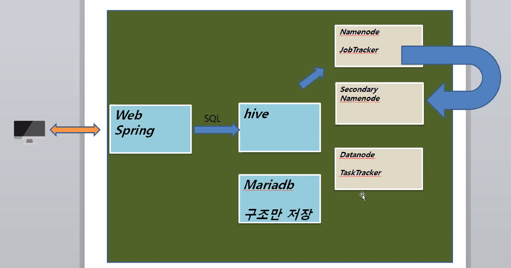

# 하이브 (564p)

* 특징 : sql문을 전송하면 sql문을 맵리듀스프로그램으로 자동으로 만들어서 분석
* Maria DB를 이용, 없으면 파일 시스템을 이용하여 저장하므로 오래걸리고 안좋음 
  실제 데이터는 데이터노드에 들어간다.
* Maria DB안에는 **"구조만"** 저장된다.

[root@mainserver local]# hostnamectl set-hostname hadoop

[root@mainserver local]# vi /etc/hosts

192.168.111.120 hadoop

★host name을 바꿨으니 mysql삭제 후 재설치

systemctl   stop  mysql

yum -y  remove Maria*


mariadb 관련 폴더들을 삭제한다.

rm -rf /etc/my.cnf*

rm -rf /var/log/mysql  

rm -rf /var/lib/mysql 

재설치

## 하이브 설치

1. Maria DB 설치

   1. download

      https://downloads.mariadb.com/MariaDB/mariadb-10.0.15/yum/centos7-amd64/rpms/

      \- client, common, server 받기

   2. 기존 MariaDB 제거

      ```bash
      [root@mainserver 다운로드]$# yum -y remove mariadb-libs
      ```

   3. MariaDB 설치

      ```bash
      [root@mainserver 다운로드]$# yum -y localinstall Maria*
      ...
      Complete!
      ```

   4. MariaDB 실행

      ```bash
      [root@mainserver 다운로드]$# systemctl restart mysql
      ```

   5. MariaDB 상태보기

      ```bash
      [root@mainserver 다운로드]$# systemctl status mysql
      ● mysql.service - LSB: start and stop MySQL
         Loaded: loaded (/etc/rc.d/init.d/mysql; bad; vendor preset: disabled)
         Active: active (running) since 수 2020-09-23 16:09:17 KST; 7s ago
           Docs: man:systemd-sysv-generator(8)
        Process: 11794 ExecStart=/etc/rc.d/init.d/mysql start (code=exited, status=0/SUCCESS)
          Tasks: 24
         CGroup: /system.slice/mysql.service
                 ├─11799 /bin/sh /usr/bin/mysqld_safe --datadir=/var/lib/mysql --pi...
                 └─11873 /usr/sbin/mysqld --basedir=/usr --datadir=/var/lib/mysql -...
      
       9월 23 16:09:16 mainserver systemd[1]: Starting LSB: start and stop MySQL...
       9월 23 16:09:17 mainserver mysql[11794]: Starting MySQL. SUCCESS!
       9월 23 16:09:17 mainserver systemd[1]: Started LSB: start and stop MySQL.
      ```

   6. 실행시 자동 실행

      ```bash
      [root@mainserver 다운로드]$# chkconfig mysql on
      ```

   7. 초기 설정 및 db열기

      ```bash
      [root@mainserver 다운로드]$# mysqladmin -u root password '111111'
      [root@mainserver 다운로드]$# mysql -h localhost -u root -p
      ```

      

   8. hive_db database 생성, hive 계정 및 비번 111111

      ```mysql
      MariaDB [mysql]> GRANT ALL ON *.* TO hive@hadoop IDENTIFIED BY '111111';
      MariaDB [mysql]> GRANT ALL ON *.* TO hive@localhost IDENTIFIED BY '111111';
      MariaDB [mysql]> GRANT ALL ON *.* TO hive@'%' IDENTIFIED BY '111111';
      MariaDB [mysql]> GRANT ALL ON *.* TO hive@'127.0.0.1' IDENTIFIED BY '111111';
      MariaDB [mysql]> GRANT ALL ON *.* TO hive@'192.168.111.120' IDENTIFIED BY '111111';
      '지우고 싶을때' DELETE FROM user WHERE host='mainserver'
      
      [root@hadoop ~]# mysql -h localhost -u hive -p
      MariaDB [(none)]> CREATE DATABASE hive_db CHARACTER SET utf8;
      '오류! MariaDB [(none)]> CREATE DATABASE hive_db로'
      MariaDB [(none)]> use hive_db
      Database changed
      MariaDB [hive_db]> exit
      ```

      

      

2. 하이브 설치

   1. 하이브 다운로드

      wget https://archive.apache.org/dist/hive/hive-1.0.1/[apache-hive-1.0.1-bin.tar.gz](https://archive.apache.org/dist/hive/hive-1.0.1/apache-hive-1.0.1-bin.tar.gz)

   2. 프로파일 수정

      ```bash
      [root@hadoop ~]$# vi /etc/profile
      HIVE_HOME=/usr/local/hive
      export ... HIVE_HOME
      PATH...:$HIVE_HOME/bin:.:$PATH
      ```

   3. 하이브 설치

      ```bash
      [root@hadoop 다운로드]$# tar xvf apache-hive-1.0.1-bin.tar.gz
      [root@hadoop 다운로드]$# mv apache-hive-1.0.1-bin hive
      [root@hadoop 다운로드]$# cp -r hive /usr/local
      ```

   4. mariadb jdbc driver를 hive 디렉토리 및에 lib에 복사

      ```bash
      [root@hadoop 다운로드]$# cp mariadb-java-client-1.3.5.jar /usr/local/hive/lib
      ```

   5. hive-site.xml추가

      ```bash
      [root@hadoop 다운로드]$# cd /usr/local/hive/conf
      [root@hadoop conf]$# vi hive-site.xml
      ```

      ```xml
      <?xml version="1.0"?>
      <?xml-stylesheet type="text/xsl" href="configuration.xsl"?>
      <configuration>
          <property>
              <name>hive.metastore.local</name>
              <value>false</value>
              <description>controls whether to connect to remove metastore server or open a new metastore server in Hive Client JVM</description>
          </property>
          <property>
              <name>javax.jdo.option.ConnectionURL</name>
              <value>jdbc:mariadb://localhost:3306/hive_db?createDatabaseIfNotExist=true</value>
              <description>JDBC connect string for a JDBC metastore</description>
          </property>
          <property>
              <name>javax.jdo.option.ConnectionDriverName</name>
              <value>org.mariadb.jdbc.Driver</value>
              <description>Driver class name for a JDBC metastore</description>
          </property>
          <property>
              <name>javax.jdo.option.ConnectionUserName</name>
              <value>hive</value>
              <description>username to use against metastore database</description>
          </property>
          <property>
              <name>javax.jdo.option.ConnectionPassword</name>
              <value>111111</value>
              <description>password to use against metastore database</description>
          </property>
      </configuration>
      ```

   6. hadoop실행

      ```bash
      [root@hadoop conf]$# cd
      [root@hadoop ~]$# start-all.sh
      ```

   7. o



569p

[root@hadoop ~]# hadoop fs -mkdir /tmp

[root@hadoop ~]# hadoop fs -mkdir /user/root/warehouse

[root@hadoop ~]# hadoop fs -chmod 777 /tmp

[root@hadoop ~]# hadoop fs -chmod 777 /user/root/warehouse

[root@hadoop ~]# hadoop fs -mkdir /tmp/hive

[root@hadoop ~]# hadoop fs -chmod 777 /tmp/hive

위 디렉토리 구조가 제대로 만들어지지 않으면 하이브가 실행되지 않는다.

[root@hadoop ~]# vi /etc/profile 을 했기때문에 리부트 필요

[root@hadoop ~]# stop-all.sh

[root@hadoop ~]# reboot

[root@hadoop ~]# start-all.sh

570p

[root@hadoop ~]# hive

...

hive> show databases;
OK
default
Time taken: 0.34 seconds, Fetched: 1 row(s)

hdi-data.csv(첨부파일) 받기


hive> CREATE TABLE HDI(id INT, country STRING, hdi FLOAT, lifeex INT, mysch INT, eysch INT, gni INT) ROW FORMAT DELIMITED FIELDS TERMINATED BY ',' STORED AS TEXTFILE;

오류! mysql에서 alter database hive_db character set latin1; 로 바꾸자

다운로드 > hdi.txt 복사

[root@hadoop 다운로드]# mv hdi-data.csv hdi.txt

[root@hadoop 다운로드]# mv hdi.txt /root

hive>load data local inpath '/root/hdi.txt' into table HDI; //하둡으로 파일이 들어감

hive> select * from hdi limit 5;

1. air data의 metastore  정보를 만든다. - 게시판
2. 2006년 데이터를 로드 한다.
3. 데이터를 조회한다.

hive > CREATE TABLE airline_delay(
Year INT,
MONTH INT,
DayofMonth INT,
DayofWeek INT,
DepTime INT,
CRSDepTime INT,
ArrTime INT,
CRSArrTime INT,
UniqueCarrier STRING,
FlightNum INT,
TailNum STRING,
ActualElapsedTime INT,
CRSElapsedTime INT,
AirTime INT,
ArrDelay INT,
DepDelay INT,
Origin STRING,
Dest STRING,
Distance INT,
TaxiIn INT,
TaxiOut INT,
Cancelled INT,
CancellationCode STRING
COMMENT 'A = carrier, B = weather, C = NAS, D = security',
Diverted INT COMMENT '1 = yes, 0 = no',
CarrierDelay STRING,
WeatherDelay STRING,
NASDelay STRING,
SecurityDelay STRING,
LateAircraftDelay STRING)
COMMENT 'TEST DATA'
PARTITIONED BY (delayYear INT)			:하나의 디렉토리로 보면된다.
ROW FORMAT DELIMITED
FIELDS TERMINATED BY ','
LINES TERMINATED BY '\n'				:라인끝날때 표기
STORED AS TEXTFILE;						: 들어가는 형태

(575p) 

2006~2008.csv 는 vi로 들어가 첫줄제거(줄제거:dd)하고 사용한다.

hive> LOAD DATA LOCAL INPATH '/root/2006.csv' INTO TABLE airline_delay
PARTITION (delayYear='2006');

//OVERWIRTE INTO: 중복무시 덮어쓴다. 하지 않으면 새로운게 새로 생긴다.

hive> LOAD DATA LOCAL INPATH '/root/2007.csv' OVERWRITE INTO TABLE airline_delay PARTITION (delayYear='2007');

hive> LOAD DATA LOCAL INPATH '/root/2008.csv' OVERWRITE INTO TABLE airline_delay PARTITION (delayYear='2008');

hive> SELECT year, month, deptime, arrtime, flightnum FROM airline_delay
WHERE delayYear='2006'
LIMIT 10; >>맵리듀스 잡 X

SELECT year, month, deptime, arrtime, flightnum FROM airline_delay;

뒤에 리미트 안붙이면 오래걸린다.

추가 년도 별 출발 지연 시간, 도착 지연 시간의 평균을 구하시오.

SELECT Year, avg(ArrDelay), avg(DepDelay) FROM airline_delay GROUP BY Year;

2008년 월별 출발 도착 지연 시간의 평균을 구하시오

SELECT Year, Month, avg(ArrDelay), avg(DepDelay) FROM airline_delay WHERE delayYear=2006 GROUP BY Year, Month ORDER BY Year, Month;

SELECT Year, Month, avg(ArrDelay), avg(DepDelay) FROM airline_delay WHERE delayYear=2006 GROUP BY Year, Month HAVING Month>=10;


order by 보다 sort by가 쪼금 더 빠르다.


Java Application 연동


hive 서버 실행 - Java 프로그램이 접속 할 수 있는 Deamon을 실행

[root]#hive --service hiveserver2

```java
//실습 연동 예제
public static void main(String[] args) throws Exception {
	String url="jdbc:hive2://192.168.111.120:10000/default";
	String id="root";
	String password="111111";
	Class.forName("org.apache.hive.jdbc.HiveDriver");
	Connection con = DriverManager.getConnection(url,id,password);
	PreparedStatement pstmt = con.prepareStatement("SELECT Year, avg(ArrDelay), avg(DepDelay) FROM airline_delay WHERE delayYear=2006 GROUP BY Year, Month");
	ResultSet rset = pstmt.executeQuery();
	while(rset.next()) {
		String did = rset.getString(1);
		String name = rset.getString(2);
		String s3 = rset.getString(3);
		System.out.println(did+" "+name+" "+s3);
	}
	System.out.println("end");
	pstmt.close();
	con.close();
}
```


필요 라이브러리

\1. /usr/local/hive/lib에 있는 몇가지 jar

1) commons-logging-X.jar

2) hive-exec-X.jar

3) hive-jdbc-X.jar

4) hive-jdbc-X-standalone.jar

5) hive-metastore-X.jar

6) hive-service-X.jar

7) libfb303-X.jar

8) log4j-X.jar

\2. /usr/local/hadoop-1.2.1/hadoop-core-1.2.1.jar


워크숍

hadoop2 서버에 hadoop과 mysql 실행

hive설치

hive 예제 실행 - hid 예제

air data 입력 및 분석

java Application 구현하여 hive와 연동


0925

start-all.sh

hive --service hiveserver2	: 하둡서버 띄우기

[root@hadoop ~]# hive

hive> show tables;
OK
airline_delay
hdi
Time taken: 0.397 seconds, Fetched: 2 row(s)

hive> SELECT * FROM hdi LIMIT 10;
OK
NULL		NULL	NULL	NULL	NULL	NULL
1	Norway	0.943	81	12	17	47557
2	Australia	0.929	81	12	18	34431
3	Netherlands	0.91	80	11	16	36402
4	United States	0.91	78	12	16	43017
5	New Zealand	0.908	80	12	18	23737
6	Canada	0.908	81	12	16	35166
7	Ireland	0.908	80	11	18	29322
8	Liechtenstein	0.905	79	10	14	83717
9	Germany	0.905	80	12	15	34854
Time taken: 0.542 seconds, Fetched: 10 row(s)

Spring project와 연동하기

java spring프로젝트 만든 후 web/WEB-INF/lib에 hivelibs들을 넣는데

 web/WEB-INF/config/spring.xml 에서 oraclebd부분제거

ws

1. 데이터를 받아온다.
   data.go.kr 서울시 .csv파일
   data.seoul.go.kr
2. HIVE Structure 만들어서 metastore에 저장 한다.
3. Data를 Hive를 통해 Hadoop에 넣는다.
4. chart2, chart3완성