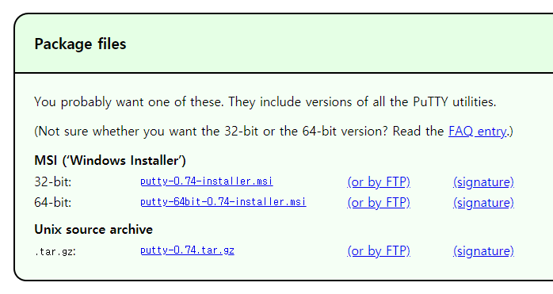
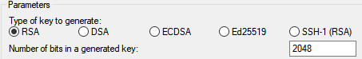
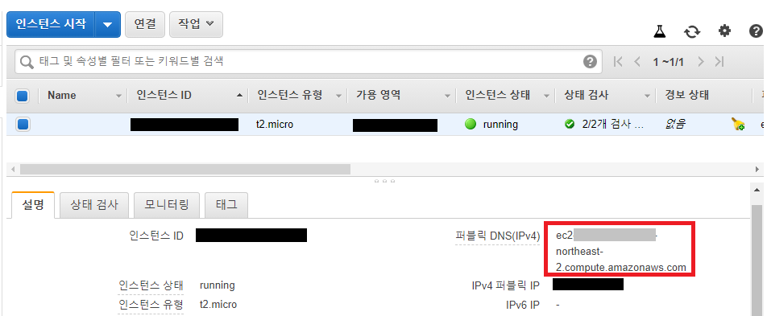
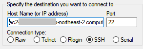

# AWS

## AWS 기본 셋팅

1. 계정 생성 및 콘솔 로그인

   [https://aws.amazon.com/ko/free/](https://aws.amazon.com/ko/free/?all-free-tier.sort-by=item.additionalFields.SortRank&all-free-tier.sort-order=asc)

2. 지역 서울로 변경

## 인스턴스 생성

1. 키페어/보안그룹 생성 [자습서](https://docs.aws.amazon.com/ko_kr/AWSEC2/latest/UserGuide/get-set-up-for-amazon-ec2.html)

   1. 키 페어 생성

      1. [Amazon EC2 콘솔](https://console.aws.amazon.com/ec2/)

      2. 탐색 > Key Pairs

      3. Create key pair(키페어 생성)

         pem으로된 키 생성(PuTTY 를 할때 ppk로 바꿀 것)

      4. 이름을 입력후 생성한다.

         * 중요, 이때 파일 다운로드는 단 한번된다.

   2. 보안 그룹 생성

      1. 탐색 > Security Groups
      2. 보안 그룹 생성
      3. 이름, VPC 기본값
      4. 인바운드 규칙 추가
         * Type - HTTP, Source - Anywhere, 0.0.0.0/0
         * Type - HTTPS, Source - Anywhrer, 0.0.0.0/0
         * Type - SSH, Source - My IP
      5. 생성

2. EC2 인스턴스 생성 (Linux2) [자습서](https://docs.aws.amazon.com/ko_kr/AWSEC2/latest/UserGuide/EC2_GetStarted.html)

   1. [Amazon EC2 콘솔](https://console.aws.amazon.com/ec2/)
   2. 대시보드 > 인스턴스 시작
   3. Amazon Machine Image(AMI) > **Amazon Linux 2 AMI (HVM), SSD Volume Type** 시작
   4. t2.micro > 검토 및 시작
   5. 보안 그룹 편집 > 기존 보안 그룹 > 위에서 생성한 보안그룹 선택
   6. 검토 및 시작
   7. 시작하기
   8. 기존 키 페어 선택 > 위에서 생성한 키페어 선택 > 체크 > 인스턴스 시작

콘솔 > 인스턴스에서 인스턴스가 뜨고 상태가 running이 되면 준비 끝

## PuTTY

[다운로드](https://www.chiark.greenend.org.uk/~sgtatham/putty/latest.html)



* `.msi` 파일을 다운로드, 실행하여 설치해준다.
* [자습서](https://docs.aws.amazon.com/AWSEC2/latest/UserGuide/putty.html?icmpid=docs_ec2_console)

### `.pem`을 `.ppk`로 변환

1. PuTTYgen 실행

2. Load > 확장자 All Files(\*.\*)로 선택 > 다운받은 `.pem ` 파일 선택

3. Parameters

   

4. Save private key > 저장할 위치 선택 후 저장


### Linux 인스턴스 연결

1. PuTTY 실행

2. 카테고리 > Session

   Host Name : DNS Name

   * DNS 이름은 콘솔의 인스턴스에서 확인이 가능

     

   Port : 22

   

3. 카테고리 > Connection > SSH > Auth

   Browse > `.ppk` 를 연다.

4. (선택) Session 저장

   * 카테고리 > Session > Saved Sessions 이름 지정 > Save

   저장해두면 현재 셋팅된 상태가 저장된다.

   * 선택 > load

## AWS GUI설치

1. [자습서](https://aws.amazon.com/ko/premiumsupport/knowledge-center/ec2-linux-2-install-gui/)

2. login as : ec2-user

3. 실행 중인 버전 확인

   ```bash
   $ cat /etc/os-release
   ```

4. 인스턴스 업데이트

   ```bash
   $ sudo yum update
   ```

### MATE 설치

1. MATE 설치

   ```bash
   $ sudo amazon-linux-extras install mate-desktop1.x
   ```

2. MATE 기본 데스크톱 정의

   ```bash
   * 모든 사용자
   $ sudo bash -c 'echo PREFERRED=/usr/bin/mate-session > /etc/sysconfig/desktop'
   * 현재 사용자에 대해서만
   $ echo "/usr/bin/mate-session" > ~/.Xclients && chmod +x ~/.Xclients
   ```

### TigerVNC

1. TigerVNC 패키지 설치

   ```bash
   $ sudo yum install tigervnc-server
   ```

2. VNC암호 (6~8자, 111111)

   ```bash
   $ vncpasswd
   vncpasswd
   Password:
   Verify:
   Would you like to enter a view-only password (y/n)? n
   A view-only password is not used
   ```

3. VNC 그외

   ```bash
   $ vncserver :1
   $ sudo cp /lib/systemd/system/vncserver@.service /etc/systemd/system/vncserver@.service
   $ sudo sed -i 's/<USER>/ec2-user/' /etc/systemd/system/vncserver@.service
   $ sudo systemctl daemon-reload
   $ sudo systemctl enable vncserver@:1
   $ sudo systemctl start vncserver@:1
   ```

4. PuTTY에서 연결, TightVNC로 View

   1. PuTTY에서 포트를 열어준다

      Connection > SSH > Tunnels

      Sorce port : `5901`, Destination: `localhost: 5901` 을 입력 > Add

      Open

   2. TightVNC를 기본값으로 [설치](https://www.tightvnc.com/download.php), TightVNC Viewer를 실행

      host : localhost: 5901

      password: 위에서 설정했던 번호

## 그 외

* Terminal: Applications > System Tools > Mate Terminal

* 크롬 설치

  ```bash
  Chromium(Google Chrome의 오픈 소스 버전)
  $ sudo amazon-linux-extras install epel
  $ sudo yum install chromium
  ```

* Root 설정 > putty

  ```bash
  //비밀번호
  $ sudo passwd root
  //계정활성화
  $ sudo vi /etc/ssh/sshd_config
  PermitRootLogin yes >>\#제거, 활성
  PasswordAuthentication no를 yes로 변경
  $ sudo mkdir /root/.ssh
  $ sudo cp /home/ec2-user/.ssh/authorized_keys /root/.ssh
  $ sudo service sshd restart
  //root로 사용자 전환
  $ su - root
  ```

* eclipse - 링크 https://www.eclipse.org/downloads/download.php?file=/technology/epp/downloads/release/2020-06/R/eclipse-jee-2020-06-R-linux-gtk-x86_64.tar.gz

* 

